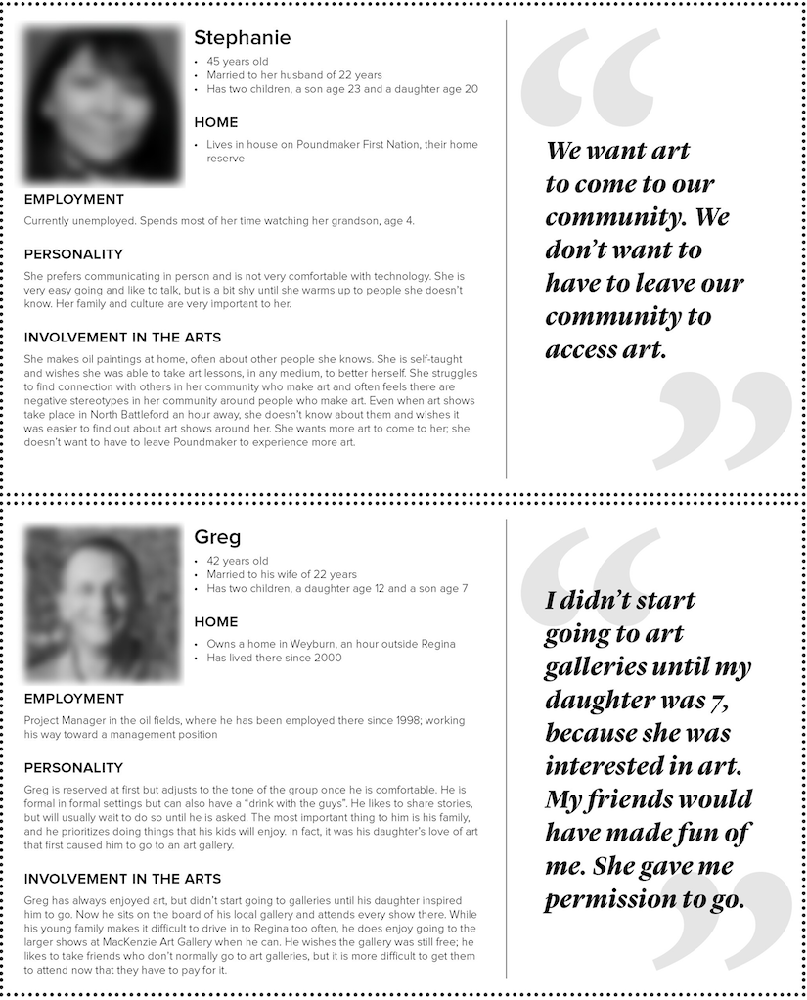
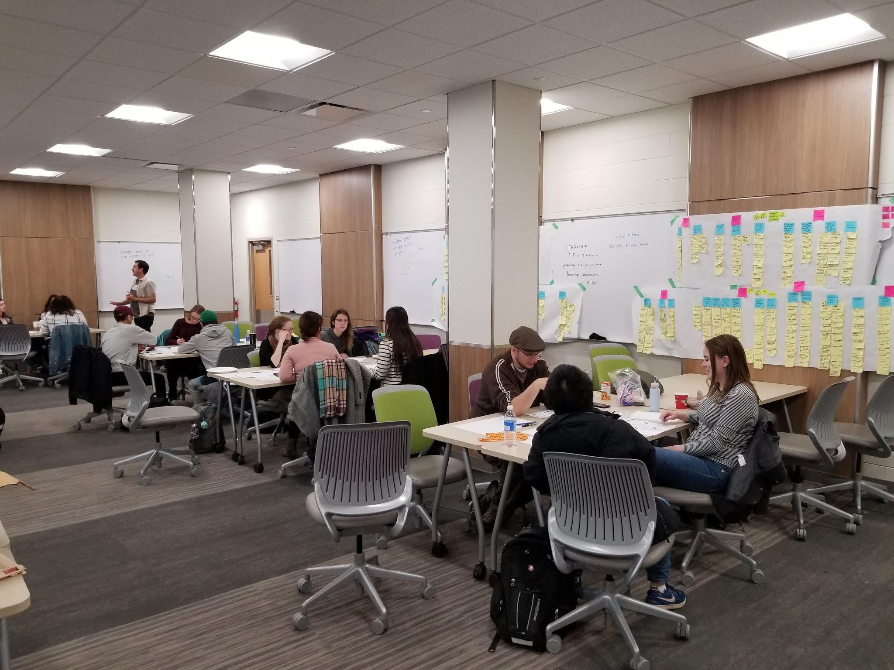
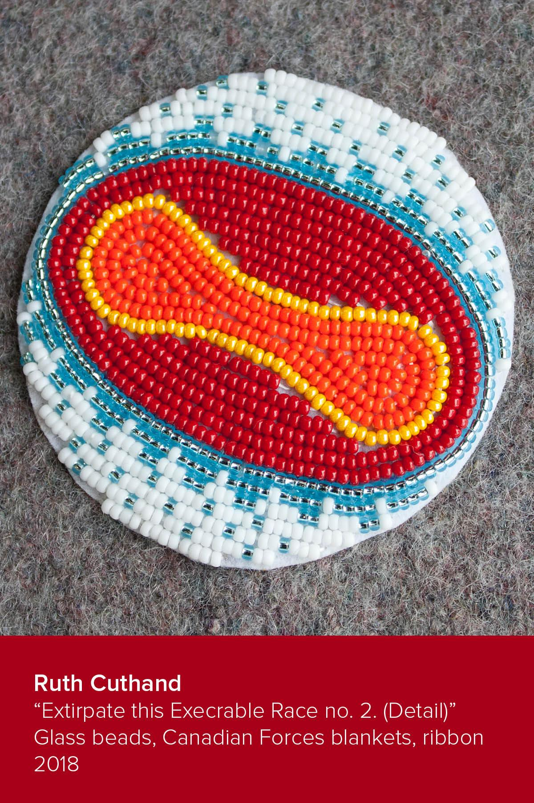
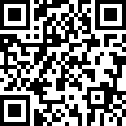
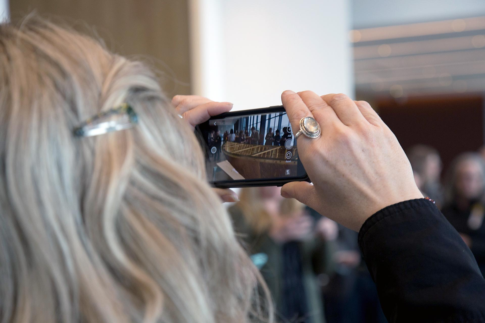

Shared Spaces U of S Project Faculty: Lisa Birke (Art & Art History), Terence Clark (Archaeology and Anthropology), Carl Gutwin (Computer Science), Craig Harkema (Library), jake moore (Art Galleries and Collections and Art and Art History), and Jeremy Morgan (former Acting-Director, College Galleries)

Shared Spaces User Engagement Assistants:

Dorothy Chung, Fatemeh Ebrahimnejadnamini, Emilie Neudorf, Athanasia Perdikaris, Caila Robson-Kullman

Shared Spaces Digital Design Assistants:

EJ Acuna, Febi Chajadi, Logan Barr, Brandon Piller, Lauren Warrington

## 

In May of 2019, a team led by the University of Saskatchewan Kenderdine Art Gallery received a Canada Council for the Arts Digital Strategy Fund grant to develop a digital service with Saskatchewan arts organizations to allow them to engage with and give voice to their audiences and other art creators. However, the exact deliverable was intentionally vague; rather than presupposing what this diverse group (from internationally recognized art galleries to community puppet theatres) needs, the grant was built around first engaging with both these organizations and their current and potential audiences in order to gain an understanding of their varied needs. Only once this assessment was done would the actual development begin. In this paper we will introduce the project, and the funding program that supported it, and describe the process of community consultation for both the development of the grant application and the needs assessment. We will introduce the findings from the first phase of the Shared Spaces project and the resulting first prototypes for arts engagement, which use augmented reality, that have gone back out to the communities for further consultation and refinement.

Introduced in 2017, the Canada Council for the Arts Digital Strategy Fund (DSF) is a four-year, $88.5 million initiative that encompasses several granting programs designed to help Canadian artists and arts organizations engage and respond to changes resulting from the increasingly digital world (Canada Council n.d.). It is very specifically not a digitization fund, but rather aims to be more transformational in how artists and arts organizations use digital technologies. There are three streams of activity that the fund will support: Digital Literacy and Intelligence, Public Access to the Arts and Citizen Engagement, and Transformation of Organizational Models. Digital Literacy and Intelligence is to assist “the arts sector in building digital knowledge, skills and capacity” through activities such as conferences, workshops, hackathons, and other research and experimentation activities. Public Access to the Arts and Citizen Engagement activities need to “improve the public’s access, engagement and participation in the arts through digital means” (Canada Council n.d.). These projects should “enhance the artistic experience of diverse publics, encourage the participation and engagement of citizens with the arts, and increase discoverability and access to the works of Canadian artists.” Finally, Transformation of Organizational Models is to “develop and explore innovative new models, prototypes and experiments that will help arts organizations transform the way they work” and “implement new governance or management approaches, workflow models, open linked data models and other innovative digital frameworks.” Depending upon the scope of the project and the stream, proposals can range from $1,000 to $500,000.

Regardless of the program stream, the core principles of DSF projects should be “a focus on collaboration, partnership and networking,” “open-mindedness, and willingness to share knowledge,” and “experimentation, risk-taking and iterative development” (Canada Council n.d.). By foregrounding risk, the DSF stands apart from many other granting programs that require the deliverables to be well-defined at the time of application. And a focus on collaboration and openness was also central in another undertaking of the University of Saskatchewan at the time the DSF was announced: Galleries Reimagined. Led by Jeremy Morgan, a long-standing member of the Saskatchewan and Canadian arts administration community, Galleries Reimagined sought to align the four University of Saskatchewan campus art galleries (Kenderdine Art Gallery, College Art Gallery 1, College Art Gallery 2, and Gordon Snelgrove Gallery) and the university art collection with the university’s academic mission, strategic goals, and community aspirations. Central to these activities would be for the campus galleries to build relationships with the broader Saskatchewan arts community, develop opportunities for cross-disciplinary outcomes connected to the arts, and include Indigenous perspectives. As soon as the DSF was announced Jeremy recognized its potential to create a research hub in the galleries that would link university researchers from diverse disciplines with individuals and organizations from around the province, and he quickly gathered a team of interested faculty: Lisa Birke and Jon Bath (Art & Art History), Terence Clark (Archaeology and Anthropology), Carl Gutwin (Computer Science), and Craig Harkema (Library). We as a group had a number of ideas for projects that we could undertake related to our own combined interests in the use of technology for collaboration (Gutwin 1998), cultural heritage engagement (Harkema and Carlson 2018; Clark et al. 2019), and artistic creation (Bath 2019; Houle and Birke 2017), but also realized that we did not understand the various challenges arts organizations in Saskatchewan were encountering related to digital technologies. Thus, a first step before we could even develop an application was to hear from these organizations. Michael Peterson, a community arts organizer who operates Void Gallery and who has been the curator for Nuit Blanche Saskatoon, was hired in order to gather this feedback and develop the grant application. Michael holds a Master of Design focused on service design, and this background, and his connections within the arts community, fundamentally shifted the focus of the proposed project from an extension of the faculties’ individual research programs to a truly community-driven project.

Michael’s first activity in developing the application was two sessions in Regina and Saskatoon with artists, arts organizations, UX designers, and members of the public; the organizations ranged from large cultural entities such as Remai Modern, Mackenzie Art Gallery, and the Saskatchewan Arts Board (now SK Arts), to Wide Open Children’s Theatre, a Saskatoon puppet troupe. He also met individually with artists and community members who attend arts events. Not surprisingly, there were differing opinions about the potentials for digital technologies, and no clear consensus for the direction we should take. It was at this point that Michael convinced the team that we should embrace the Canada Council’s call for “experimentation, risk-taking and iterative development” and make our project about a community-driven design process rather than a specific technology, as outlined in our application:

> This initiative will develop and implement digital approaches with arts organizations across Saskatchewan, allowing them to better engage with and give voice to their audiences. Partnering with digital design experts at the University of Saskatchewan … we will employ user centred and service design methodologies to make new technologies for the arts accessible to smaller Saskatchewan organizations. By promoting conversation around art online and allowing audience members a greater ability to contribute, this project will democratize the process of viewing and curating, allowing for the inclusion of currently underrepresented voices, including Indigenous peoples.

The exact “digital approaches” are not explained, for at this point we did not know what they would be. However, from our initial information gathering there was already a recognition that most digital tools developed to-date were either for the creation of digital artwork or required significant resources for content development, thereby limiting them to large institutions. There seemed to be a real opportunity to develop accessible tools for smaller organizations and individuals to be able to share their works and connect with a broader audience. In order to ensure we were meeting the exact needs of these users, the project was structured around consulting with these user groups throughout the entire project, not just at the initial stage, to give them ample opportunities to share their observations and feedback. These meetings would also provide a way for these communities to learn more about the user-centred design process. The entire project was based on the core values of reciprocity, transparency, and fairly recompensing participants for their contributions.

Our project was awarded $480,000 in late 2018 as a multi-phase project running from June 2019 to June 2022. Michael Peterson was hired as the project manager and he assembled a team of undergraduate and graduate student user engagement assistants. In the summer of 2019 they undertook seven community visits to meet with groups of potential users—artists, arts administrators, and community members. They visited Estevan, La Ronge, Little Pine First Nation, North Battleford, Regina, Saskatoon, and Yorkton, and these group sessions were augmented by one-on-one interviews with others who could not attend the sessions. In total, 101 people participated. Where possible, a member of the community organized the session and gathered the participants. These sessions focused around just a couple of questions, and most of them did not concern the digital. What we needed to know as a project team is what makes a positive art engagement experience and what hurdles currently prevent these positive experiences from happening. We were also interested in their current use of digital technologies, but those questions came after the more broad discussion of arts engagement. All of this information was compiled and the user engagement team used a process of affinity diagramming to cluster the findings into areas of similarity (Martin and Hannington 2012, 12-13). These clusters were then used to create specific personas (Figure 1) to represent the eventual users of the technologies we would develop (Cooper 2004, 123-37). For more details on these and other design methodologies used in the project, please see https://sharedspaces.usask.ca/research.

With these personas developed we were able to move to the second stage of the project and develop the first prototypes. This phase began with a 2-day hackfest where the user engagement team was joined by over a dozen undergraduate and graduate students from Archaeology, Anthropology, Computer Science, Visual Art, and Art History. Working in groups of three, they chose specific personas to design for and iteratively created, and presented, various paper prototypes (Figure 2). Throughout this entire process we stressed that all designs must focus on the needs of the persona, and not what they individually preferred. As the weekend progressed, some of the teams ended up merging as their designs overlapped. By the end of the weekend, the designs had coalesced around two main concepts: “travelling” exhibitions enabled by augmented reality (AR) instead of physically transporting works and map-based systems for discovering art and events. The first idea seemed to be most in-line with what we were hearing from our community partners in rural and remote locations, and the easiest to rapidly prototype, so we are beginning with it (with the understanding that other ideas may also be developed as the project progresses).

At this point we wanted to rapidly develop a first prototype so we could take it back out to the communities to determine if it was something they were interested in, and, if so, to hear their suggestions for improving it; conversely, if it was unsatisfactory for them, we needed to know why so we could move in a different direction. A small development team of students from Computer Science, Archaeology, and Visual Art was tasked with exploring existing solutions for phone-based AR and with 3D scanning a number of objects and paintings from the college galleries and the U of S Museum of Antiquities. At this stage we did not want to put any effort into developing our own platform until we received the community partners’ approval. They settled on using the Augment and Artivive apps to display the sample AR exhibit because they are very user friendly. A virtual exhibit of eight paintings and two sculptural objects was created and Michael returned with our User Engagement Assistants to the communities to present the prototype in late November and early December 2019.

Reactions to these first prototypes were very interesting. In the larger centres, the reception was mixed; in particular, some participants wondered why anyone would want to look at art this way instead of going to the actual exhibit and seeing the “real” objects. It was not until one of the other participants in the session pointed out that many people do not have the option of going to a gallery that they considered that possibility. In one of the more remote communities there was a similarly skeptical participant. During the demo she did not participate and instead just watched others. After the demo she was convinced it was an idea worth pursuing because she saw how the community members were actively engaged walking around the virtual sculpture, and how they were doing so together. This experience also revealed the value of having participants share a device, rather than each using their own. A common thread throughout our consultations has been the desire to talk to others about the event or exhibit, and the use of a shared device appears to facilitate this conversation. This finding also led to the project finally getting a name: Shared Spaces. Another finding has been that despite the project team’s initial belief that the triggers should be aesthetically pleasing, participants seem to prefer generic QR codes or using actual artworks to trigger supplementary AR material. For the first demo sessions, Michael designed and screen-printed unique trigger images. However, participants were confused by these images and expected the resulting 3D model to be related to its trigger. Once he switched to the more generic image, participants were more able to focus on the AR experience rather than the trigger image. After these initial user tests, the team developed some further refined prototypes for presentation at the Canadian Crafts Federation’s Ten Digit Technology conference. Figure 3 is an example of how an actual object, or a printout of an image of an object, can be used to trigger supplementary material; here, an image of beadwork by Ruth Cuthand that has been augmented with a video by the artist explaining the work. In our consultations we found that one barrier to engagement with art is that people feel they do not know enough about the artwork to meaningfully engage with it. Figure 4 is a life-size 3D model of the last birchbark canoe made by Isaiah Roberts. The canoe is currently held by the University of Saskatchewan but is being repatriated to the Lac La Ronge Indian Band. This prototype was to test whether engaging with a virtual object that would otherwise be inaccessible provided a meaningful experience. Figures 5 and 6 show the participants of the conference engaging with the canoe model.

 presenting the virtual Isaiah Roberts canoe at the Canadian Crafts Federation conference. Actual canoe partially visible in background. Photo by Fatemeh Ebrahimnejadnamini.")

These prototypes and community re-visits have convinced us that there is value, especially in rural and remote communities, in developing this prototype further. The next stage of development is to develop our own AR application so we can integrate it with a mechanism for arts organizations to post their own content and for viewers to comment. During the next phase of the project we will also teach participants how to 3D scan artworks, building capacity for organizations, and perhaps even individuals, to scan and augment artworks on their own for contribution to the project. At each step of the development process we are committed to returning to the communities both for testing to ensure we are meeting their needs, and not just what we think their needs are, and for sharing our research methodologies and findings.

## References

Bath, Jon. 2019. “Artistic Research Creation for Publicly Engaged Scholarship.” *KULA: Knowledge creation, dissemination, and preservation studies* 3, no.1. DOI: [http://doi.org/10.5334/kula.10](http://doi.org/10.5334/kula.10).

Canada Council for the Arts. n.d. “Digital Strategy Fund,” Accessed March 10, 2020. [https://canadacouncil.ca/funding/strategic-funds/digital-strategy-fund](https://canadacouncil.ca/funding/strategic-funds/digital-strategy-fund).

Clark, Terence, Matthew Betts, Gary Coupland, Jerome S. Cybulski, Jasmine Paul, Philippe Froesch, Steven Feschuk, Raquel Joe, and Gretchen Williams. 2019. “Looking into the eyes of the ancient chiefs of shíshálh: The osteology and facial reconstructions of a 4000-year-old high-status family.” In *Bioarchaeology of Marginalized People,* edited by Madeleine L. Mant and Alyson Jaagumägi, 53-67. Holland: Academic Press. [https://doi.org/10.1016/B978-0-12-815224-9.00004-X](https://doi.org/10.1016/B978-0-12-815224-9.00004-X).

Cooper, Alan. 2004. *The Inmates Are Running the Asylum: Why High Tech Products Drive Us Crazy and How to Restore the Sanity*. 2nd Edition. Indianapolis: Sams Publishing.

Gutwin, Carl and Saul Greenberg. 1998. “Design for individuals, design for groups: tradeoffs between power and workspace awareness.” In *Proceedings of the 1998 ACM conference on Computer supported cooperative work* (*CSCW ’98*), 207-16. New York: Association for Computing Machinery. DOI: [https://doi.org/10.1145/289444.289495](https://doi.org/10.1145/289444.289495).

Harkema, Craig and Keith Carlson. 2018. “The Oral History of Photographs: Collaboration, Multi-Level Engagement, and Insights from the Adrian Paton Collection.” *KULA: Knowledge creation, dissemination, and preservation studies* 2, no.1. DOI: [http://doi.org/10.5334/kula.4](http://doi.org/10.5334/kula.4).

Houle, Terrance and Lisa Birke. 2017. *Different Ways*. Live performance and video installation. Part of Flotilla Atlantic, Sept 21st –24th 2017. Charlottetown, PEI: Association of Artist-Run Centres from the Atlantic and Ed Video.

Martin, Bella, and Bruce Hanington. 2012. *Universal Methods of Design*. Beverly, MA: Rockport.

